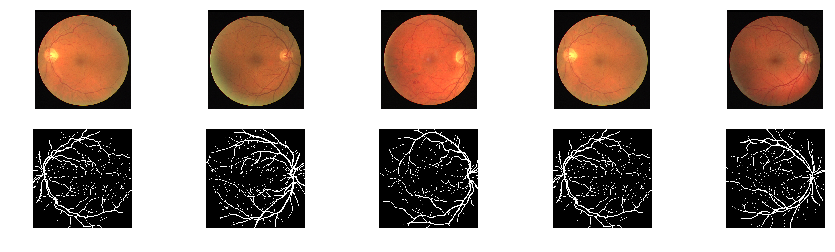

# Retinal Vessel Segmentation

EE4476 Image Processing Course project for vessel segmentation reimplementation using PyTorch.

* Paper: [Retinal Vessel Segmentation in Fundoscopic Images with Generative Adversarial Networks](https://arxiv.org/abs/1706.09318)
* Dataset: [DRIVE](http://www.isi.uu.nl/Research/Databases/DRIVE/)

Project report available: [report](./Project_Report.pdf)

To add training code and report soon.
